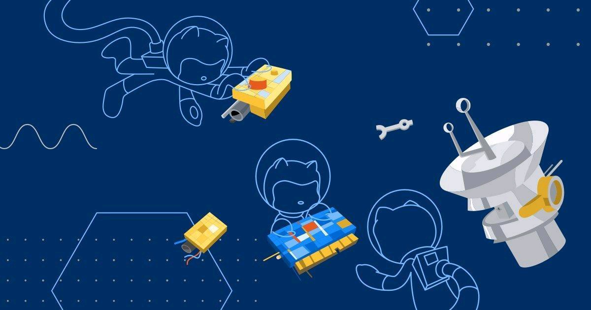

<h1 align="center" >Hi, I'm <a href="https://www.linkedin.com/in/mrsamirr/" target="_blank"> Md Samer Ansari </a></h1>

<h1 align="center" >Currently pursuing my B.Tech degree in Computer Science & Engineering from Asansol Engineering College. I am a Fresher Student Devloper. </h1>

<h3 align="center">A passionate New Fresher developer from India🧑🏻‍💻 </h3> 

  

    

<h1 align=center>

&nbsp;&nbsp;&nbsp;&nbsp; Lets Get Connected🌐:

    

     <a href="mailto: smaitykhan@gmail.com"> <a  href="https://instagram.com/samirr.in"> 
   
   

   </a>

 

<h1 align=center>

&nbsp;&nbsp;&nbsp;&nbsp; Language & Tools ⚡: 

 
 

<h1 align=center>

&nbsp;&nbsp;&nbsp;&nbsp;Github Stats 📈: </h2>

<table>

<tr>

<td>

<td>

</td>

</tr>

</table>

<!--START_SECTION:waka-->

